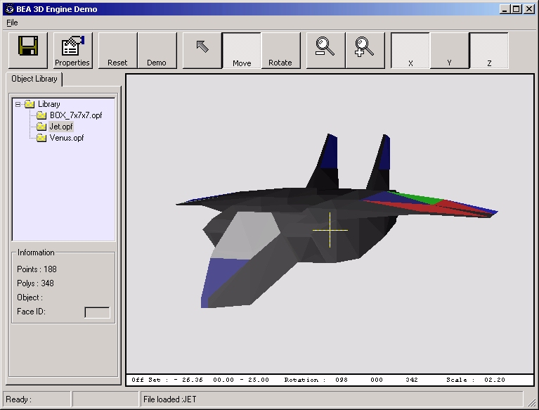



## BEA3D

### Description

Some basic 3D Stuff uses matrix Transformations
 
### More Info
 

             |
---                |---
**Submitted On**   |2003-10-14 09:51:24
**By**             |[Brent Albertson](https://github.com/Planet-Source-Code/PSCIndex/blob/master/ByAuthor/brent-albertson.md)
**Level**          |Advanced
**User Rating**    |4.8 (38 globes from 8 users)
**Compatibility**  |VB 6\.0
**Category**       |[Graphics](https://github.com/Planet-Source-Code/PSCIndex/blob/master/ByCategory/graphics__1-46.md)
**World**          |[Visual Basic](https://github.com/Planet-Source-Code/PSCIndex/blob/master/ByWorld/visual-basic.md)
**Archive File**   |[BEA3D1851202102005\.zip](https://github.com/Planet-Source-Code/brent-albertson-bea3d__1-58830/archive/master.zip)

### API Declarations

Lots See code

